Airbnb - Analyze what factors do influence the price of a listing in LA and Predict price for a new listing
---
# Prologue
*"Airbnb happened because two guys could not pay their rent, but did have some space."* 
<br><br>
Yes, that's how Air-bed and breakfast(Airbnb) started when Joe and Martin from San Francisco rented out their three airbeds to make some cash.Since then, guests and hosts have used Airbnb to travel in a more unique and personalized way.The story of Airbnb's foundation is fascinating and is here: [airbnb](http://www.airbnb.com/home/story).
<br><br>
Airbnb is a hospitality service which enables people to lease or rent a short-term accommodation.The company does not own any lodging. It is merely an agent.It receives a percentage service fees (commissions) from both guests and hosts for every booking.  
<br>
A Host can create a listing by selecting the "Host" menu after logging in.The Price for the listing is decided by the host himself. The owner can charge different prices for nightly, weekly, and monthly stays. Hosts then add a description of the residence, amenities, available dates, cancellation policies, and any house rules.Potential guests are required to message the host directly through Airbnb to ask questions regarding the property.After the reservation, the hosts coordinate meeting times and contact information with the guests. Airbnb guests can leave a review and rate a listing after their stay.This rating can be used as an indicator of the experience they had during their stay.
<br>
Airbnb was started small and soon the concept turned out to be popular among those people who were on the verge of losing their homes due to financial difficulties and also the travelers who are looking for a home away from home.
[Wiki](https://en.wikipedia.org/wiki/Airbnb) is always there for more information.

# Problem Setup
In this project, I am working on the Los Angeles based Airbnb listings.  
My objective is to understand how the different features can influence the price for a listing in LA.  
I would provide a tool to estimate the price of a listing in LA based on its features.  
<br>
Thus, to summarize, this Capstone Project will answer the below questions:
<br>
1. How the different attributes/features can influence the price for a Airbnb listing in LA?   
2. What price would be suitable for a new listing in LA?  
3. How the price of a listing is affecting the Review Rating?  

# Potential client  

1. A new host who is looking for some recommendation for the price he should list for his property  
2. Or, Someone who is willing to list his property in Airbnb site in Los Angeles and gathering information on what are the factors that would affect the price for a listing   
3. Or, an existing host who already has an Airbnb listing in LA and looking for a revision in price to get more customers and better reviews.    

# The Data
I am going to use the datasets loaded in [insideairbnb](http://insideairbnb.com/get-the-data.html) for Los Angeles, California. The latest data sets are added on May,2017. The below datasets are included: 

<br>

1. Detail_Listings.csv
2. Summary_Listings
3. Detail_Reviews.csv  
4. Summary_Reviews.csv  
5. Calendar.csv  
6. Neighbourhoods.csv  
<br>
For this project, I will use the "Detail_Listings.csv" file alone.This Data file has 31253 records with 1 record for each individual listing.There are 95 columns representing different features for each listing.  

```{r include = FALSE}
# Load Libraries
library(tidyr)
library(dplyr)
library(ggplot2)
## 1. Loading, cleaning and preparing
setwd("/Users/oindrilasen/WORK_AREA/Data Science/Springboard/Exercise/Capstone Project/Data Sets")
Detail_listing <- read.csv("Detail_listings.csv",
                    header = TRUE,
                    na.strings = "",
                    stringsAsFactors = FALSE)
```
Below is a glimpse of the "Detail_listings.csv" data file:
```{r}
glimpse(Detail_listing)
dim(Detail_listing)
```
# Data Wrangling and Cleaning
"Detail_Listings.csv" Dataset contains 95 columns. I will remove some of the columns that won't be useful based on the goals I have for this project. I would be using the below columns from the Dataset:
```{r include = FALSE}
clean_listing <- select(
  Detail_listing,
  id,
  accommodates,
  host_response_rate,
  host_is_superhost,
  host_has_profile_pic,
  host_identity_verified,
  host_listings_count,
  instant_bookable,
  property_type,
  room_type,
  bathrooms,
  bedrooms,
  beds,
  bed_type,
  cancellation_policy,
  availability_365,
  price,
  weekly_price,
  monthly_price,
  cleaning_fee,
  security_deposit,
  number_of_reviews,
  review_scores_rating
)
```
```{r}
glimpse(clean_listing)
```
<br>
Now, my current Dataset has 23 variables for 31,253 observations. I need to clean the data for further analysis.  
<br>
1. The Price columns are of "Char" data type and contains a Dollar sign and a comma. I need to remove the "'$'" and "," and then convert them into a Numeric variable for my analysis. Below are the price columns that I would be using:
<br>

* price  
* weekly_price    
* monthly_price  
* cleaning_fee  
* security_deposit  
<br>

```{r}
#Remove "$" and "," from the price columns
# Transforming prices to number
clean_listing$price <-
  gsub("\\$", replacement = "", clean_listing$price)
clean_listing$price <-
  gsub(",", replacement = "", clean_listing$price)
clean_listing$price <- as.numeric(clean_listing$price)

clean_listing$security_deposit <-
  gsub("\\$", replacement = "", clean_listing$security_deposit)
clean_listing$security_deposit <-
  gsub(",", replacement = "", clean_listing$security_deposit)
clean_listing$security_deposit <-
  as.numeric(clean_listing$security_deposit)

clean_listing$cleaning_fee <-
  gsub("\\$", replacement = "", clean_listing$cleaning_fee)
clean_listing$cleaning_fee <-
  gsub(",", replacement = "", clean_listing$cleaning_fee)
clean_listing$cleaning_fee <- as.numeric(clean_listing$cleaning_fee)

clean_listing$weekly_price <-
  gsub("\\$", replacement = "", clean_listing$weekly_price)
clean_listing$weekly_price <-
  gsub(",", replacement = "", clean_listing$weekly_price)
clean_listing$weekly_price <- as.numeric(clean_listing$weekly_price)

clean_listing$monthly_price <-
  gsub("\\$", replacement = "", clean_listing$monthly_price)
clean_listing$monthly_price <-
  gsub(",", replacement = "", clean_listing$monthly_price)
clean_listing$monthly_price <-
  as.numeric(clean_listing$monthly_price)

```
<br>
2. The Categorical Variables need to be converted into Factors. Below are the Variables that needs to be converted to Factors:  

* host_response_rate  
* host_is_superhost  
* host_identity_verified 
* host_has_profile_pic  
* instant_bookable  
* property_type  
* room_type  
* bed_type  
* cancellation_policy 
<br>

```{r}
# Transforming to factors:
to_factor <- c(
  'host_has_profile_pic',
  'host_response_rate',
  'host_is_superhost',
  'instant_bookable',
  'host_identity_verified',
  'property_type',
  'room_type',
  'bed_type',
  'cancellation_policy'
)
for (col in to_factor) {
  clean_listing[[col]] <- factor(clean_listing[[col]])
}
```
<br>
3. Before proceeding further, let's deal with the 'NA' Values. First, let's find out how many 'NA' values we have for each variable and below is the result:  
<br>

```{r}
sapply(clean_listing, function (x) sum(is.na(x)))
```
* host_is_superhost:   
This Variable has categorical values TRUE and FALSE. So, let's assume the NA records are FALSE i.e. The records for which a value is not there is not a Super Host.  

```{r}
## Assuming that NAs in the host_is_superhost columns are False
clean_listing$host_is_superhost[is.na(clean_listing$host_is_superhost)] <- "f"
```
* Bedrooms,Bathrooms & Beds:   
For Bedrooms, Bathrooms and Beds variables, there are a coulple of NA records. These variable are nemerical and let's replace the NA value with  the most common value for that variable.

```{r}
## Replacing the NAs with the MEAN value of that column
table(clean_listing$bedrooms)
clean_listing$bedrooms[is.na(clean_listing$bedrooms)] <- 1

table(clean_listing$bathrooms) 
clean_listing$bathrooms[is.na(clean_listing$bathrooms)] <-1

table(clean_listing$beds) 
clean_listing$beds[is.na(clean_listing$beds)] <- 1
```
* Price columns:  
Let's assume that the NAs are actually zeros for  all the price columns and replace all NA values with 0. 
```{r}
## Assuming that NAs in the price columns are 0
clean_listing$cleaning_fee[is.na(clean_listing$cleaning_fee)] <- 0
clean_listing$security_deposit[is.na(clean_listing$security_deposit)] <-
  0
clean_listing$weekly_price[is.na(clean_listing$weekly_price)] <- 0
clean_listing$monthly_price[is.na(clean_listing$monthly_price)] <- 0
```
* Review_scores_rating:   
There are 7527 observations where the review_scores_rating is NA.Let's Replace the NA values with the median value of the ratings.
```{r}
## Replacing the NAs 0 % rating
clean_listing$review_scores_rating[is.na(clean_listing$review_scores_rating)] <-  median(clean_listing$review_scores_rating, na.rm = TRUE)
```
* host_response_rate:   
Host_reasponse_rate column has both "N/A" and "NA" values. First, let's convert the records with "N/A" values to "NA" and then convert the NA records to "0%". It would be helpful if this variable is numeric. To convert it to a Number variable, we need to remove the "%" sign first.
```{r}
# convert the records with "N/A" values to "NA"
levels(clean_listing$host_response_rate)[levels(clean_listing$host_response_rate) == "N/A"] <- NA
# convert the NA records to "0%"
clean_listing$host_response_rate[is.na(clean_listing$host_response_rate)] <- "0%"
# Remove the % sign
clean_listing$host_response_rate <-
  gsub("\\%", replacement = "", clean_listing$host_response_rate)
# Convert the variable to nemeric
clean_listing$host_response_rate <-as.numeric(clean_listing$host_response_rate)
```
* host_identity_verified:   
This Variable has categorical values of TRUE and FALSE. So, let's assume the NA records are FALSE i.e. the records which do not have a value for this variable, the host identity is not verified.
```{r}
clean_listing$host_identity_verified[is.na(clean_listing$host_identity_verified)] <- "f"
```
* host_has_profile_pic: 
This Variable has categorical values TRUE and FALSE. So, let's assume the NA records are FALSE i.e. the records which do not have a value for this variable, the host has not uploaded a profile picture. 
```{r}
## Assuming that NAs in the host_has_profile_pic columns are False
clean_listing$host_has_profile_pic[is.na(clean_listing$host_has_profile_pic)] <- "f"
```
* host_listings_count: 
This Variable has numerical value.So, let's assume the NA records are equal 1 since at least one listing is there for the host.
```{r}
## Replacing the NAs with the 1
clean_listing$host_listings_count[is.na(clean_listing$host_listings_count)] <- 1
```
Let's check again if any column has a NA value:
```{r}
sapply(clean_listing, function (x) sum(is.na(x)))
```
So, now we do not have any NA records.  
<br>
4. For the Property_Type Varaible, most of the listings are either an Aprtment or an independent House. There are a few listings for the rest of the categories.
```{r}
table(clean_listing$property_type)
```
<br>

So, let's keep only 3 categories for the property_type variable as below for simplicity:  
1. Apartment  
2. House  
3. Others

```{r include = FALSE}
# Modify the levels of  Property_type variable
levels(clean_listing$property_type)
levels(clean_listing$property_type)[2:17] <- "Others"
levels(clean_listing$property_type)[4:20] <- "Others"
```
<br>
5. Let's check the price variable.

```{r}
summary(clean_listing$price)
quantile(clean_listing$price, probs = seq(0.1, 0.9, 0.1))
```
<br>
Let's restrict our analysis to those listings whose price is less or equal to $500/per night. The goal of this project is to understand the prices for the vast majority of the listings. We would not like our analysis to be influenced by some unusually expensive properties.
<br>

```{r}
# take a subset of the records with price <= 500
clean_listing <-
  clean_listing %>%
   filter(price <= 500)
dim(clean_listing)
```
<br>
So, now our current dataset has **29,982** observations which is 95% of the original dataset with **31,253** observations.
<br><br>
6. Let's check the cancellation_policy for the listings:

```{r}
table(clean_listing$cancellation_policy)
```
Since there are only a few observations under the categories "super_strict_30" and "super_strict_60", let's change the cancellation_policy to "strict" for these observations.

```{r}
# Change the few observations that have cancelation policy of super_strict_30 and super_strict_60 to strict
levels(clean_listing$cancellation_policy)[levels(clean_listing$cancellation_policy) =="super_strict_30"] <- "strict"
levels(clean_listing$cancellation_policy)[levels(clean_listing$cancellation_policy) =="super_strict_60"] <- "strict"
```

# Adding New Features

**1. has_weekly_discount & has_monthly_discount:**
<br>
There is a weekly_price variable and a monthly_price vraiable. For, some of the listings, there are values for these two vraiables. Let's add two new features based on these two variavle to see if there is a discount if someone is booking the listing weekly basis or a monthly basis.

```{r}
# Add 2 new columns has_weekly_discount and has_monthly_discount
clean_listing$has_weekly_discount <- 
ifelse(((clean_listing$price * 7) - clean_listing$weekly_price) > 0 & clean_listing$weekly_price!= 0, "Yes", "No" )
clean_listing$has_monthly_discount <- ifelse(((clean_listing$price * 30) - clean_listing$monthly_price) > 0  & clean_listing$monthly_price!= 0, "Yes", "No" )
```

**2. good_host_response:**
<br>
Based on the existing variable "host_response_rate", let's add a new feature "good_host_response". Considering, if a host is responding 60% of the time, then the host_response_rate is good.

```{r}
clean_listing$good_host_response <- ifelse(clean_listing$host_response_rate  > 60, "Yes", "No" )
```
<br>
**Now, the data is ready for analysis.**  

# Exploratory Data Analysis
Let's summarize the vraiables with some visuals.Here, my goal is as below:  
<br>
1. Understand the variables individually    
2. Spot relationships between all the explanatory variables and the price  
<br><br>
**1. Understand the variables individually**
<br><br>
**1. Price:**       
Since we are working on understanding the Price for the Airbnb listings in LA, let's first check what's the price range for the listings in LA. 

```{r}
ggplot(clean_listing, aes(x = price)) +
  geom_histogram(color = 'black',
                 fill = 'light blue',
                 na.rm = TRUE) +
  scale_x_continuous(limits = c(0, 500), breaks = seq(0, 500, 50)) +
  scale_y_continuous(limits = c(0, 6000), breaks = seq(0, 6000, 500))+
  ggtitle("Price Trends for Airbnb Listings in LA") 
```
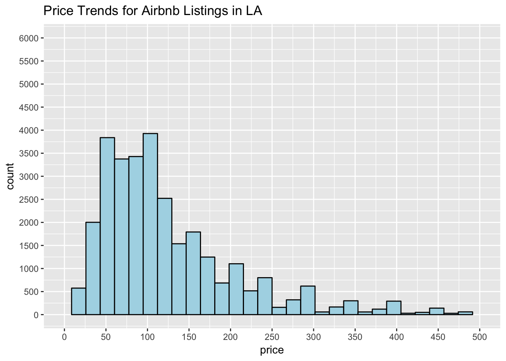

<br>
**Conclusion:** It looks like most of the Airbnb properties in LA are in the range of 50 - 120 dollars per night. There are only a few listing in higher price range. 
<br> <br>
**2. Property_Type & Room_Type:**    
Let's see what type of property are usually rented out as part of an Airbnb in LA.

```{r}
table(clean_listing$property_type, clean_listing$room_type)

ggplot(clean_listing, aes(x=property_type,fill=room_type)) +
  geom_bar(na.rm = TRUE)
```
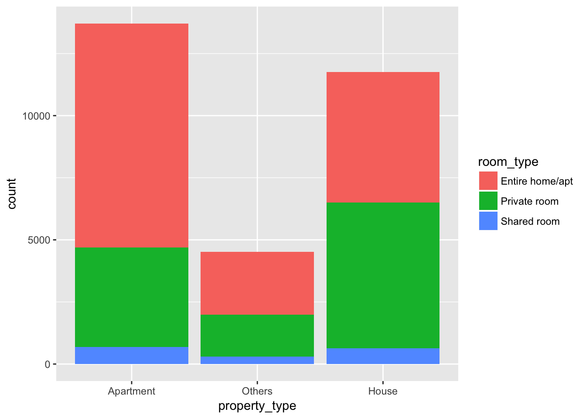

<br>
**Conclusion:** For Airbnb, people usually rent out their entire home or entire apartment or even a private room in their house.Also, it is observed here that entire home or a private room is more in demand than a shared accomodation which is really understandable.
<br><br>
**3. Bed_Type:**      
Let's see what types of beds are mostly used in Airbnbs.

```{r}
ggplot(clean_listing, aes(x = bed_type)) +
  geom_bar(fill = 'light green', na.rm = TRUE)
```

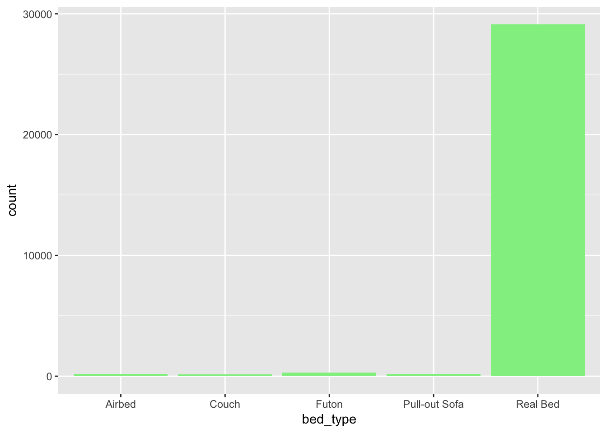
<br>

**Conclusion:** Though the concept of Airbnb starterd with Airbeds, it looks like Real Reds are much more popular nowadays.
<br><br>
**4.Cancellation_policy:**     
Let's see what cancellation policy are more appropriate for an Airbnb in LA.

```{r}
ggplot(clean_listing, aes(x = cancellation_policy)) +
  geom_bar(fill = 'blue', na.rm = TRUE)
```


<br>

**Conclusion:** Hosts are usually strict regarding any cancellation which is quite natural because a cancellation means some loss in business.
<br><br>
**5. Host_is_superhost:**    
Let's see the ratio of Super Hosts vs Normal Host

```{r}
prop.table(table(clean_listing$host_is_superhost))
ggplot(clean_listing, aes(x = host_is_superhost)) +
  geom_bar(fill = 'light yellow')
```


<br>

**Conclusion:** Only 20% of the hosts in LA are identified as a "Super" host.
<br><br>
**6. Host_identity_verified:**    
Let's see if most of the host's identity is verified in LA Airbnb

```{r}
prop.table(table(clean_listing$host_identity_verified))
ggplot(clean_listing, aes(x = host_identity_verified)) +
  geom_bar(fill = 'light blue')
```


<br>

**Conclusion:** 70% of the host's identity is verified in LA and still there are 30% of the hosts whose identity is not yet verified and that's alarming.
<br><br>
**7. Instant_bookable:**    
Instant Book listings don't require an approval from the host before they can be booked. Instead, guests can just choose their travel dates, book, and discuss check-in plans with the host.  

```{r}
prop.table(table(clean_listing$instant_bookable))
ggplot(clean_listing, aes(x = instant_bookable)) +
  geom_bar(fill = 'light green')
```

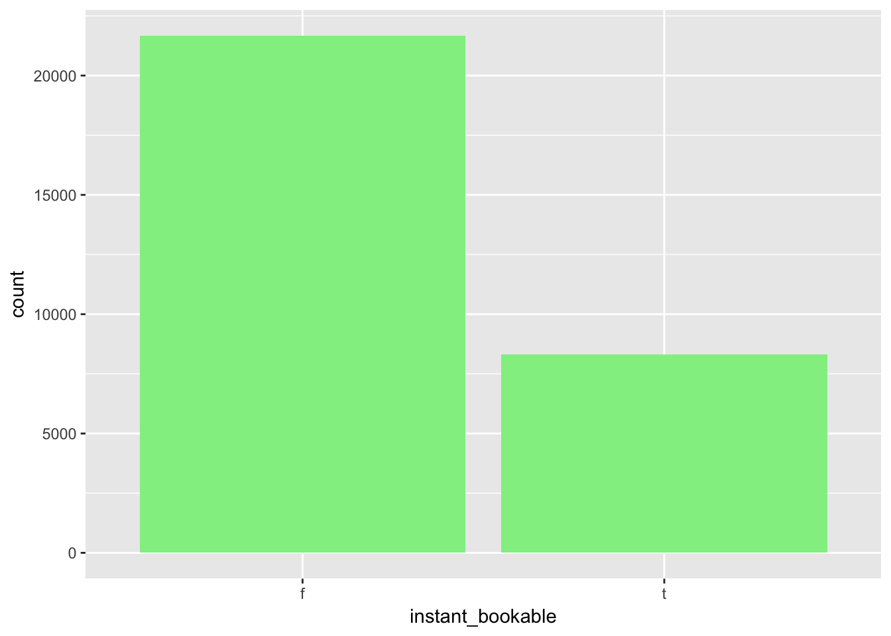

<br>

**Conclusion:** Instant_booking is NOT opted by most of the hosts yet.But this feature can attract more guests since it can save some time.
<br><br>
**8. has_monthly_discount:**  

```{r}
prop.table(table(clean_listing$has_monthly_discount))
ggplot(clean_listing, aes(x = has_monthly_discount)) +
  geom_bar(fill = 'light blue')
```


<br>
Most of the host is not providing any monthly discount and it's unlikely to book a listing for a month.
<br><br>
**8. has_weekly_discount:**  

```{r}
prop.table(table(clean_listing$has_weekly_discount))
ggplot(clean_listing, aes(x = has_weekly_discount)) +
  geom_bar(fill = 'light blue')
```

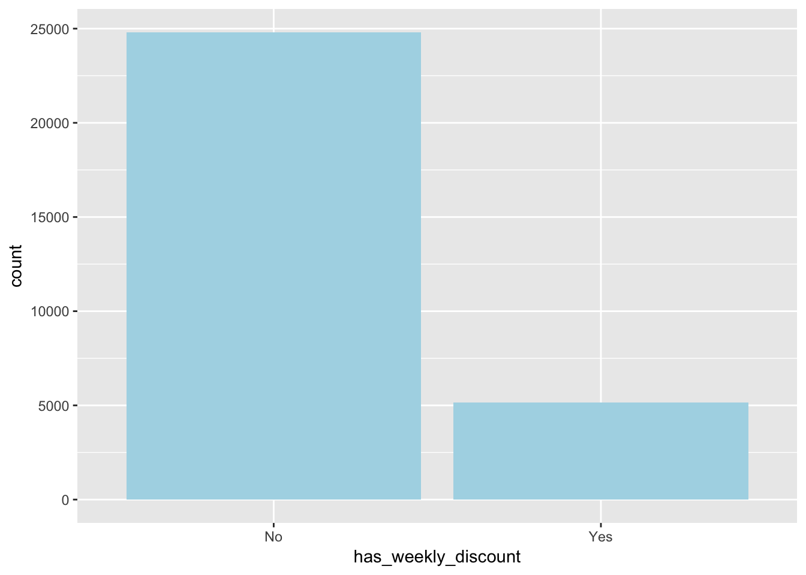

<br>

Again, weekly discount is also not available for most of the listings.
<br> <br>

**2. Spot relationships between the explanatory variables and price**  
<br><br>
1. Plot price vs number_of_reviews  
<br>

```{r}
ggplot(clean_listing, aes(x = number_of_reviews, y = price)) +
  geom_point() +
  geom_smooth(method = lm, fullrange=TRUE)+
    scale_x_continuous(limits = c(0, 600), breaks = seq(0, 600, 100))

```


<br>

It looks like usually the less price listings has more reviews which is expected since people usually look for some budget friendly properties.
<br><br>
2. Plot price vs bedrooms  
<br>

```{r}
ggplot(clean_listing, aes(x = factor(bedrooms), y = price)) +
  geom_boxplot(na.rm = TRUE) +
  ylim(50, 500)
```
<br>


As per the above plot results, the price for the listings with more bedrooms are usually more. That means a 1 bedroom apartment is less price than a 3 bedroom apartment and the result is as expected.
<br><br>
3. Plot price vs bathrooms  
<br>

```{r}
ggplot(clean_listing, aes(x = factor(bathrooms), y = price)) +
  geom_boxplot(na.rm = TRUE) +
  ylim(50, 500)
```


<br>

Again,as per the above plot results, the price for the listings with more bathrooms are usually more. That means a 2 bedroom apartment with 1 bath is less price than a 2 bedroom apartment with 2 baths and the result is as expected.
<br><br>
4. Plot price vs cancellation_policy  
<br>

```{r}
ggplot(clean_listing, aes(x = cancellation_policy, y = price)) +
  geom_boxplot(na.rm = TRUE) +
  ylim(50, 500)
```
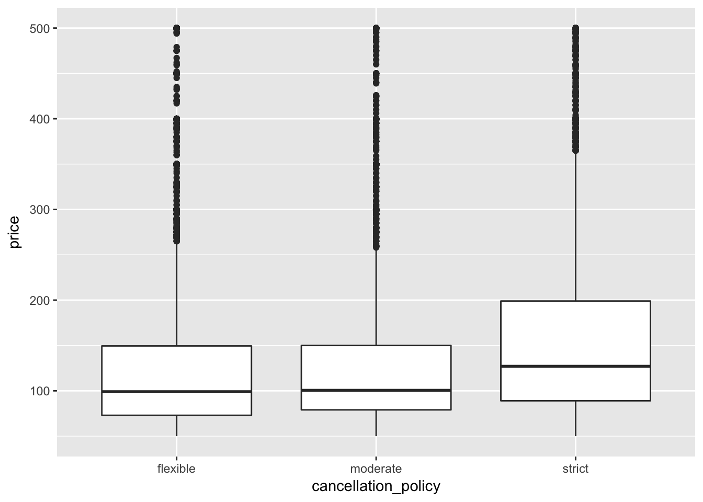

<br>
Cancellation Policy does not influence the price much.So, a host can select a strict cancellation policy and choose the same price as a listing with a flexible cancellation policy.
<br><br>
5. Plot price vs property_type  
<br>

```{r}
  ggplot(clean_listing, aes(x = property_type, y = price)) +
  geom_boxplot(na.rm = TRUE) +
  ylim(00, 500)
```


<br>

As per the plot, the Mean price for each property type is at the range of  $100 per night and the property type does not have a great influence on price.
<br><br>
6. Plot price vs room_type  
<br>

```{r}
ggplot(clean_listing, aes(x = room_type, y = price)) +
  geom_boxplot(na.rm = TRUE) +
  ylim(00, 500)
```
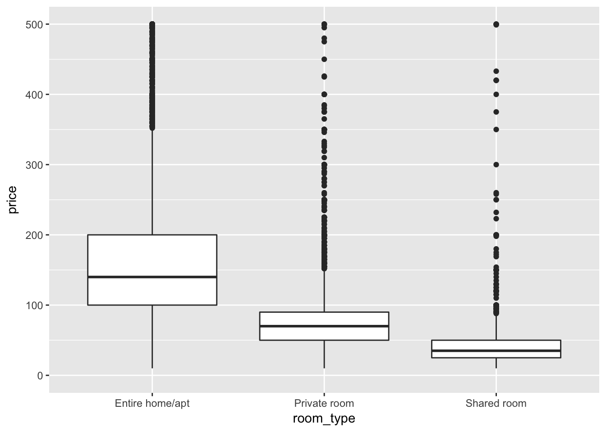


As per the plot, shared room has the least Mean price. The private rooms have a little higher Mean price than a shared accomodation, but quite less than the entire home. The entire home shows a lot more variation
on average than a private room or a shared accomodation.
<br><br>
7. Plot price vs bed_type  
<br>

```{r}
ggplot(clean_listing, aes(x = bed_type, y = price)) +
  geom_boxplot(na.rm = TRUE) +
  ylim(00, 500)
```


The price is not much influenced by what type of Bed is there.Real Beds has a slightly more Mean price than any other types.
<br><br>
8. Plot Price vs No. of Beds

```{r}
ggplot(clean_listing, aes(x = factor(beds), y = price)) +
  geom_boxplot(na.rm = TRUE) +
  ylim(0, 500)
```


As per the plot, it looks like with an increase in number of beds, the price is increasing. But then, there is a little drop in price for beds number equal to 8 or 10 or 16.
<br><br>
9. Plot price vs accomodates
<br>

```{r}
ggplot(clean_listing, aes(x = factor(accommodates), y = price)) +
  geom_boxplot(na.rm = TRUE) +
  ylim(0, 500)
```
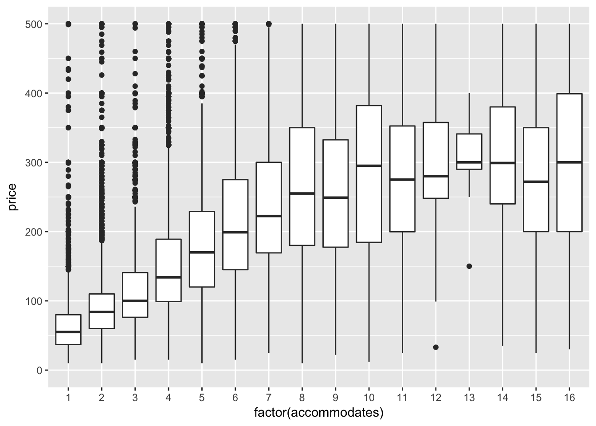

As per the plot, the price is increasing with an increase in the number of accomodates the host does allow for a listing.
<br><br>

10. Plot price vs host_response_rate

```{r}
ggplot(clean_listing, aes(x = good_host_response, y = price)) +
  geom_bar(fill = 'light blue',na.rm = TRUE, stat = "identity") +
  scale_y_continuous(limits = c(0, 500), breaks = seq(0, 500, 50))
```
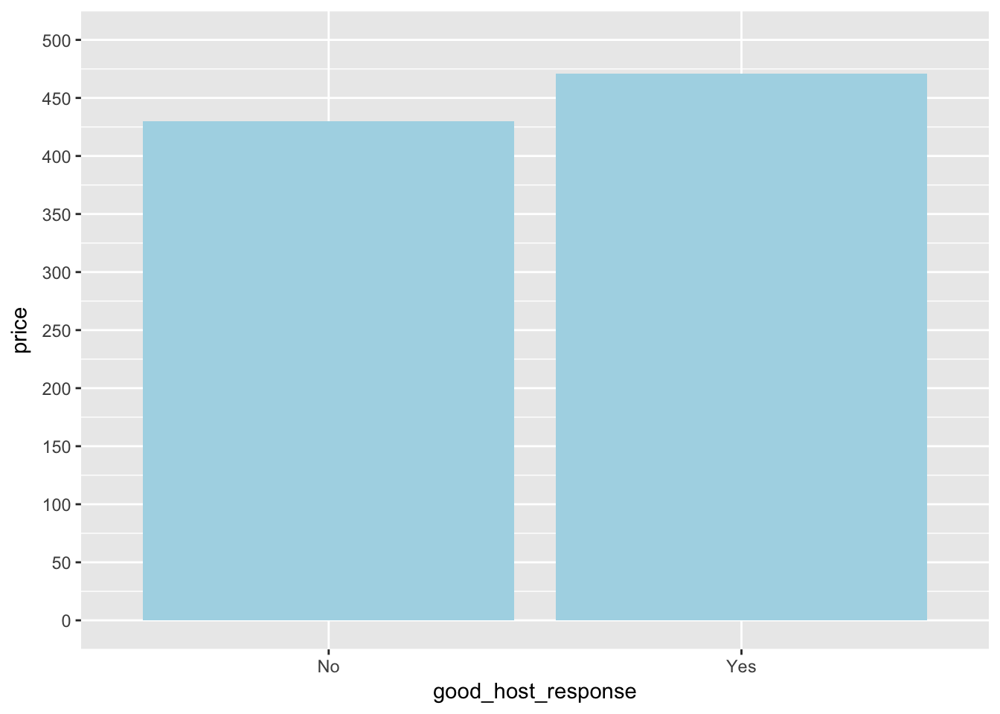


Apparently, host with better response can claim better price for their listing.  

# Create a Model 
Let's create a Linear Regresion Model to predict the price of an Airbnb Listing in LA. 
First, we will divide the records into training and test dataset. 80%  of the Records goes to Training Set and the rest 20% to Test Set.

```{r include = FALSE}
set.seed(150)
#Sample Indexes
indexes = sample(1:nrow(clean_listing), size = 0.2 * nrow(clean_listing))
# Split dataset into training and test set
test_data = clean_listing[indexes, ]
train_data = clean_listing[-indexes, ]
```

```{r}
dim(train_data) 
dim(test_data)  
```
Let's build our model to predict price for the Budget Listings.
```{r}
# Create a Linear Regression Model
lm_model <-
  lm(
    price ~  host_identity_verified + instant_bookable + room_type +                 bedrooms + bathrooms +
      beds + availability_365 +
      accommodates + security_deposit + host_is_superhost                     +cleaning_fee + property_type
    + has_weekly_discount + has_monthly_discount
    + good_host_response + cancellation_policy ,
    data = train_data
  )
summary(lm_model)
```
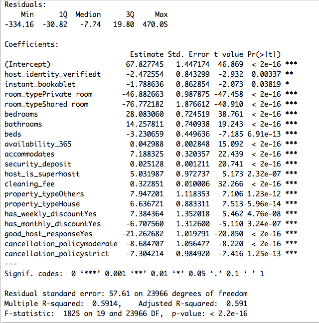

Let's check the accuracy of this model.
<br>
```{r}
predict.lm_model <- predict(lm_model, test_data)
head(predict.lm_model)
head(test_data$price)
SSE <- sum((test_data$price - predict.lm_model) ^ 2)
SST <- sum((test_data$price - mean(test_data$price)) ^ 2)
R_Squared_Value <- 1 - SSE / SST
R_Squared_Value
```
<br>
The Adjusted R-Squared value for the linear regression model to predict the price of an Airbnb listing is **0.591**. For the test data set, the R-Squared value is **0.5883346** which is almost the same as the training set data. 

# Conclusion  

The scope of this project is to understand how the different features can influence the price and to create a tool to predict the price for an Airbnb listing.
<br><br>
Though, the current Linear Regression Model to predict the price is not perfect (R-Squared Value = 0.59), the model still would be helpful for providing a guidance for pricing.  
<br>
Finally, let's summarize our observations for the Airbnb dataset and build our own data story.
<br><br>
1. Price for most of the listings in LA is in the range of $50 to $120 per night.
<br><br>
2. Airbnb started with 3 Airbeds and with time Real Bed has gained more popularity.
<br><br>
3. Most of the Airbnb hosts prefer a strict cancellation policy as a last minute cancellation can incur loss. 
<br><br>
4. Renting out an enire home or an entire apartment can be more beneficial to quote a better price than a private room or a shared one. <br><br>
5. Usually an Aprtment or an independent house is more in demand. Maybe that's because many families prefer an Airbnb during a vacation to get a feeling and comfort of their own home. Aventurous options like a Boat or a Treehouse are there but less in number.
<br><br>
Now, let's understand how the different features are related to the Price.
```{r}
coefficients(lm_model)
```
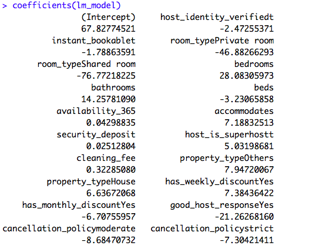


The below features have a **Positive** relation with price. i.e. while selecting a price for a new listing in LA, we can conclude that if the host is a "Super Host", he can ask for a better price. Or, a house with more bedrooms and bathrooms (a bigger house) that accomodates more people can get better price. 
<br>
1. bathrooms  
2. availability_365  
3. security_deposit  
4. cleaning_fee  
5. property_typeHouse  
6. property_typeOthers  
7. has_weekly_discountYes  
8. bedrooms  
9. accommodates  
10. host_is_superhostt  
<br> <br>
The below features have a **Negative** relation with price as per the data we are using for our analysis. i.e. That means the listings with Private rooms and Shared rooms can get less price. If the Host is Strict or Moderate with the cancellation policies, usually they ask for a lesser price. 
<br><br>
1. instant_bookablet  
2. room_typeShared room  
3. room_typePrivate room  
4. has_monthly_discountYes  
5. cancellation_policymoderate  
6. cancellation_policystrict  
7. good_host_responseYes  
8. beds  
9. host_identity_verifiedt  

# Future Scope  

1. Exploring and adding some more features could improve the current model for predicting price of an LA bsed Airbnb Listing.
<br><br>
2. There is a future scope to analyze and understand how the review scores are getting influenced by the different features and build a model to predict the review scores ratings.
<br><br>
3. Using the other available Datasets in Airbnb like the one for Reviews, we can also try to build a Reccomendation Model for the Guests.
<br><br>
4. We can try to categorize the Guests' sentiments for each of the listings.  
<br><br>
                    --The End--

